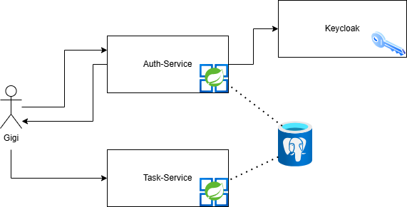

# README

## Overview

This project consists of two main microservices:

- **Auth Service**: Handles user authentication (e.g., sign-up, login) using Keycloak as the underlying identity provider.
- **Task Management Service**: Manages tasks (create, list, update, delete, share) for authenticated users.

Additionally, **Keycloak** runs in a Docker container to handle OAuth2 / OIDC flows.

---

## Architecture Overview




**High-Level Explanation**:

- **User** logs in or signs up via **Auth Service**.
- **Auth Service** calls **Keycloak** for token issuance, user creation, etc.
- **Task Service** is called for task management actions only if reuqest is authorized by access_token.


---

## How to Run and Test

### Docker Compose

1. **Clone** this repository.
2. In the project root, locate the `docker-compose.yml`. It cntains:
    - **Keycloak** container (exposes port 8081)
    - **Auth Service** container (exposes port 8082)
    - **Task Service** container (exposes port 8083)
    - **PostgreSQL** container (exposes port 5432)
3. **Run** the following command in your terminal:

```declarative
docker-compose up --build
```

4. Docker will:
    - Build images for **Auth Service** and **Task Service**.
    - Start **Keycloak** , plus the microservices and the shared DB.
    - A **healthcheck script** ensures Keycloak’s realm is fully initialized before the Task Service fully starts. This script repeatedly checks Keycloak’s `/.well-known/openid-configuration` for the specified realm (`rrom-realm`) until Keycloak is ready.

### Swagger

* Auth-Service -> http://localhost:8082/swagger-ui/index.html#/
* Task-Service -> http://localhost:8083/swagger-ui/index.html#/

## Postman Collection Usage

We have a **Postman** collection demonstrating:

- **Sign Up** (create user in Keycloak and Auth Service)
- **Log In** (get tokens)
- **Create / List / Update / Delete / Share** tasks in Task Service

### `X-User` Header

In the **Task Service** requests, we pass a custom header:

```declarative
X-User: <username>
```


This indicates which user is performing the action. For exampel, `X-User: edi` means we’re listing or creating tasks for user `edi`.


Subsequent requests in the task-service shoul use the access_token provided by login request which is set up automatically:

```declarative
Bearer {{access_token}}
```

---


